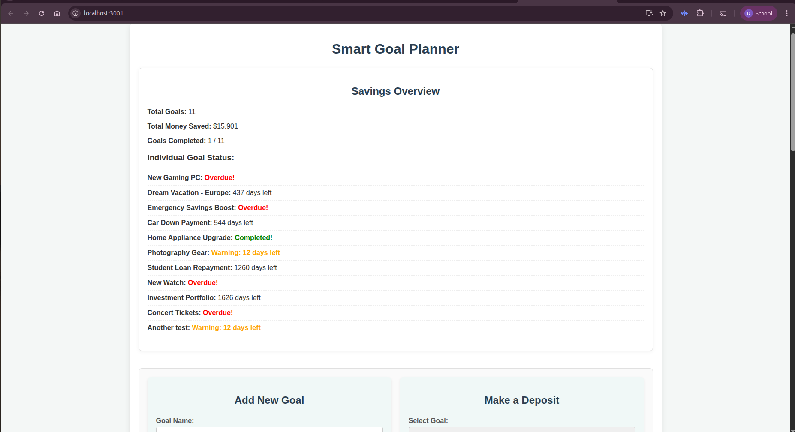

# The Smart Goal Planner

A dynamic, interactive financial goal management application built with React, HTML, CSS, and featuring a mock backend with JSON Server.

By David Chumo

## Description

This is a comprehensive, yet user-friendly, financial goal management application. It's designed to empower users to define, track, and manage multiple savings goals with ease. The application showcases modern frontend development concepts including React's component-based architecture, state management with Hooks, asynchronous data fetching, and dynamic UI updates. It leverages JSON Server to simulate a backend API, allowing users to perform full CRUD (Create, Read, Update, Delete) operations on their financial goals with persistence.

### Screenshot




## Features

* **Multiple Savings Goals:** Create, update, and delete any number of financial goals. Each goal comes with a name, target amount, category, and a clear deadline.

* **Real-time Progress Tracking:** Visualize your savings journey with dynamic progress bars, showing the total amount saved against your target and the remaining balance.

* **Easy Deposits:** Seamlessly add funds to any of your active goals, instantly updating your progress.

* **Comprehensive Overview:** Get a birds-eye view of your financial health:

  * Total number of goals.

  * Aggregate savings across all goals.

  * Count of completed goals.

  * Time remaining until each goal's deadline.

  * **Smart Alerts:** Get warnings for goals nearing their deadline (within 30 days) and clear indicators for overdue goals.

* **Persistence:** All your goal data is securely stored and managed via a RESTful API. For the live site, this backend is hosted on Render.com. For local development, a `db.json` file simulated with `json-server` is used.

## How to Use

### Requirements

1. A computer with Node.js installed (for npm commands).

2. Access to the internet (for initial package downloads).

3. A modern web browser (e.g., Chrome, Firefox, Edge, Safari).

4. A code editor (VS Code recommended).

5. Terminal/Command Line.

### Live Site
Open the live site: glowing-dusk-1e375c.netlify.app/
You can interact with the site to explore its features.

### Local Development

If you want to run the project locally, follow these steps:

#### Installation Process

* **Clone the repository:**

  ```bash
  git clone [https://github.com/kandadave/goal-planner](https://github.com/kandadave/goal-planner)
  cd goal-planner
  ```
  

  * **Install Frontend Dependencies:**
    Navigate to the project root directory in your terminal and install the React app's dependencies:

    ```bash
    npm install

    ```

  * **Install `json-server` (Globally):**
    If you haven't already, install `json-server` globally. This allows you to run it from any directory.

    ```bash
    npm install -g json-server

    ```

#### Setup `db.json`

Ensure you have a `db.json` file in the **root directory** of your `goal-planner` project. This file will serve as your local database. You can use the provided example data:

```json
{
  "goals": [
    {
      "id": "11",
      "name": "New Gaming PC",
      "targetAmount": 2500,
      "savedAmount": 750,
      "category": "Electronics",
      "deadline": "2025-05-01",
      "createdAt": "2024-07-15"
    },
    {
      "id": "12",
      "name": "Dream Vacation - Europe",
      "targetAmount": 8000,
      "savedAmount": 1500,
      "category": "Travel",
      "deadline": "2026-09-30",
      "createdAt": "2024-03-20"
    },
    {
      "id": "13",
      "name": "Emergency Savings Boost",
      "targetAmount": 3000,
      "savedAmount": 2800,
      "category": "Emergency",
      "deadline": "2024-10-31",
      "createdAt": "2024-06-05"
    },
    {
      "id": "14",
      "name": "Car Down Payment",
      "targetAmount": 15000,
      "savedAmount": 4000,
      "category": "Vehicle",
      "deadline": "2027-01-15",
      "createdAt": "2024-01-01"
    },
    {
      "id": "15",
      "name": "Home Appliance Upgrade",
      "targetAmount": 1200,
      "savedAmount": 1200,
      "category": "Home",
      "deadline": "2024-07-20",
      "createdAt": "2024-05-10"
    },
    {
      "id": "16",
      "name": "Photography Gear",
      "targetAmount": 1800,
      "savedAmount": 500,
      "category": "Hobby",
      "deadline": "2025-08-01",
      "createdAt": "2024-04-25"
    },
    {
      "id": "17",
      "name": "Student Loan Repayment",
      "targetAmount": 10000,
      "savedAmount": 2000,
      "category": "Debt",
      "deadline": "2028-12-31",
      "createdAt": "2024-02-14"
    },
    {
      "id": "18",
      "name": "New Watch",
      "targetAmount": 400,
      "savedAmount": 0,
      "category": "Shopping",
      "deadline": "2025-02-28",
      "createdAt": "2024-07-18"
    },
    {
      "id": "19",
      "name": "Investment Portfolio",
      "targetAmount": 20000,
      "savedAmount": 3000,
      "category": "Investment",
      "deadline": "2030-01-01",
      "createdAt": "2023-11-01"
    },
    {
      "id": "20",
      "name": "Concert Tickets",
      "targetAmount": 300,
      "savedAmount": 150,
      "category": "Entertainment",
      "deadline": "2024-09-01",
      "createdAt": "2024-07-05"
    }
  ]
}
```

### Running the Application

1.  **Start `json-server` (Backend Simulation):**
    Open a **new terminal window** (separate from where you'll run the React app), navigate to your project's root directory, and run:

    ```bash
    json-server --watch db.json --port 3000

    ```

    You should see output indicating that `json-server` is serving resources, including `http://localhost:3000/goals`.

2.  **Start the React Development Server (Frontend):**
    In your **original terminal window** (or another new one), navigate to the project's root directory and run:

    ```bash
    npm start

    ```

    This will open the Smart Goal Planner in your default web browser at `http://localhost:3000`.

## Technologies Used

  * **React.js (ES6+):** For building the interactive user interface with a component-based architecture and managing application state using Hooks.
  * **HTML5:** For structuring the web content.
  * **CSS3:** For styling and creating the appealing, responsive layout.
  * **JSON Server:** A lightweight server used to create a fake REST API quickly, providing persistence for financial goals to the `db.json` file.

## Support and Contact Details

If you have any questions, suggestions, or need assistance, please contact:

Email: kandachumo@gmail.com

### License

MIT License Copyright © 2025 David Chumo

Permission is hereby granted, free of charge, to any person obtaining a copy of this software and associated documentation files (the "Software"), to deal in the Software without restriction, including without limitation the rights to use, copy, modify, merge, publish, distribute, sublicense, and/or sell copies of the Software, and to permit persons to whom the Software is furnished to do so, subject to the following conditions:

The above copyright notice and this permission notice shall be included in all copies or substantial portions of the Software.

THE SOFTWARE IS PROVIDED "AS IS", WITHOUT WARRANTY OF ANY KIND, EXPRESS OR IMPLIED, INCLUDING BUT NOT LIMITED TO THE WARRANTIES OF MERCHANTABILITY, FITNESS FOR A PARTICULAR PURPOSE AND NONINFRINGEMENT. IN NO EVENT SHALL THE AUTHORS OR COPYRIGHT HOLDERS BE LIABLE FOR ANY CLAIM, DAMAGES OR OTHER LIABILITY, WHETHER IN AN ACTION OF CONTRACT, TORT OR OTHERWISE, ARISING FROM, OUT OF OR IN CONNECTION WITH THE SOFTWARE OR THE USE OR OTHER DEALINGS IN THE SOFTWARE.

